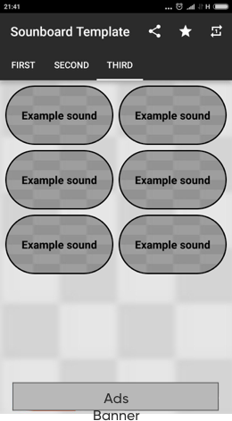

# Soundboard-Template
Soundboard-Template - is the fast and easy way to create soundboard app by yourself.

    Keep in mind that this is an android template.
To do this you should to complete a few steps:

* Find sounds that will be contains in your soundboard;
* Provide short text description for sound buttons (optional);
* Add to each sound an image for more laconic view (optional);
* Implement Soundboard-Template to your app.

## Implementation
To create your own soundboard firstly you should to implement Soundboard-Template into your main
project as submodule. Repository contains an [example app](https://github.com/ZephyrVentum/Soundboard-Template/tree/master/sample)
that can help you to do this. Also you can use as an example that [application](https://github.com/ZephyrVentum/HoMM3-Soundboard) what already
based on Soundboard-Template.

## Configuration

##### Stylize your soundboard
To change soundboard color you should to rewrite existing color in *color.xml* main project file.
To change background just add **bg_main** file into your drawable res folder.
##### Configure ads tokens
To provide tokens of your adMob ads you should to rewrite *strings.xml* file of your main project.
##### Add sounds
All sounds should be added into **raw** res folder. All sounds should be compatible with [SoundPool](https://developer.android.com/reference/android/media/SoundPool) audio manager.

## License
Copyright 2018 Alexander Klimenko

   Licensed under the Apache License, Version 2.0 (the "License");
   you may not use this file except in compliance with the License.
   You may obtain a copy of the License at

       http://www.apache.org/licenses/LICENSE-2.0

   Unless required by applicable law or agreed to in writing, software
   distributed under the License is distributed on an "AS IS" BASIS,
   WITHOUT WARRANTIES OR CONDITIONS OF ANY KIND, either express or implied.
   See the License for the specific language governing permissions and
   limitations under the License.